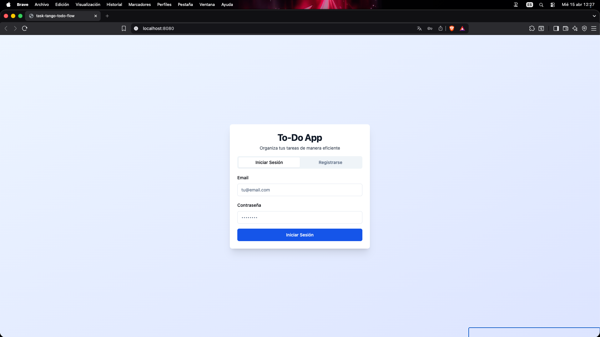
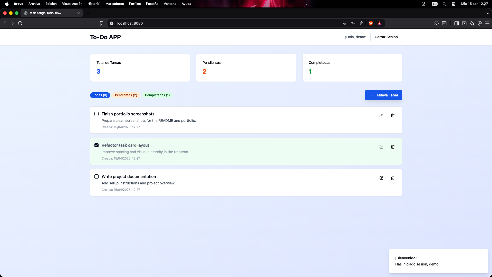
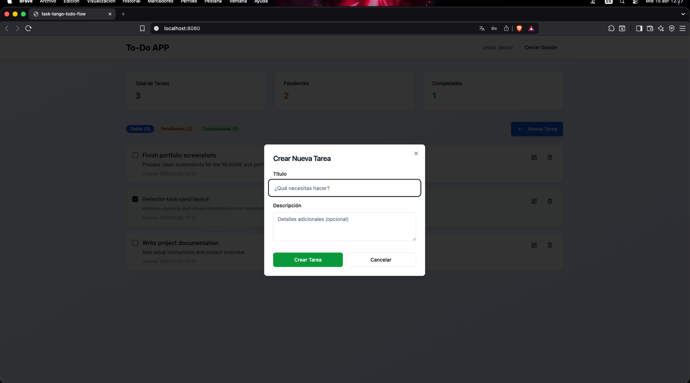

# To-Do App

Aplicación web de gestión de tareas desarrollada con **React** en el frontend y **Flask** en el backend. Permite gestionar tareas de forma sencilla mediante una interfaz moderna, con opciones para crear, editar, completar y eliminar tareas.

## Screenshots

<p align="center">
  
  
</p>

<p align="center">
  
</p>

## Features

- User authentication interface with login and registration flow
- Create new tasks with title and description
- Edit existing tasks
- Mark tasks as completed or pending
- Delete tasks
- Filter tasks by status
- Clean and responsive user interface

## Tech Stack

### Frontend
- React
- TypeScript
- Vite
- Tailwind CSS
- shadcn/ui

### Backend
- Python
- Flask
- Flask-CORS

### Database
- PostgreSQL or SQLite, depending on the environment and setup

## Project Structure

```bash
to-doapp/
├── backend/
│   ├── app.py
│   ├── db.py
│   ├── models.py
│   ├── routes/
│   │   ├── auth.py
│   │   └── tasks.py
│   └── requirements.txt
│
├── frontend/
│   ├── public/
│   ├── src/
│   │   ├── components/
│   │   ├── hooks/
│   │   ├── pages/
│   │   ├── types/
│   │   └── main.tsx
│   ├── package.json
│   └── vite.config.ts
│
├── .github/
│   └── assets/
│       ├── to-doapp-log-in.png
│       ├── to-doapp-main-panel.png
│       └── to-doapp-new-task.png
│
└── README.md
```

## Installation

### Clone the repository

```bash
git clone https://github.com/YOUR-USERNAME/to-doapp.git
cd to-doapp
```

### Backend setup

```bash
cd backend
pip install -r requirements.txt
flask run
```

### Frontend setup

```bash
cd frontend
npm install
npm run dev
```

## Main Functionality

- Create tasks
- Edit title and description
- Toggle completion status
- Delete tasks
- Display task information in a clear dashboard

## Notes

This project was originally built as a full-stack task management application. The screenshots included in this repository are intended to showcase the interface and overall user flow of the application for portfolio purposes.

## Author

Developed by **Gabrixu Games**
